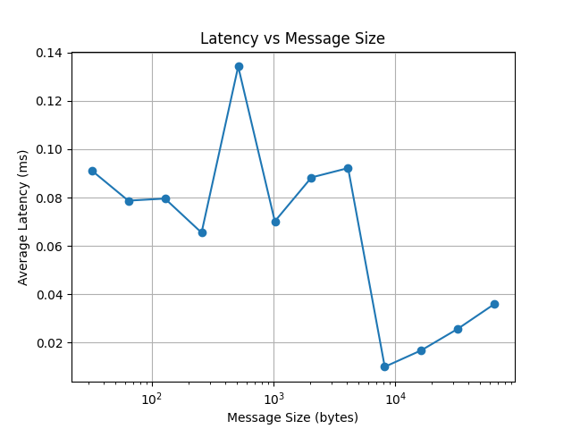
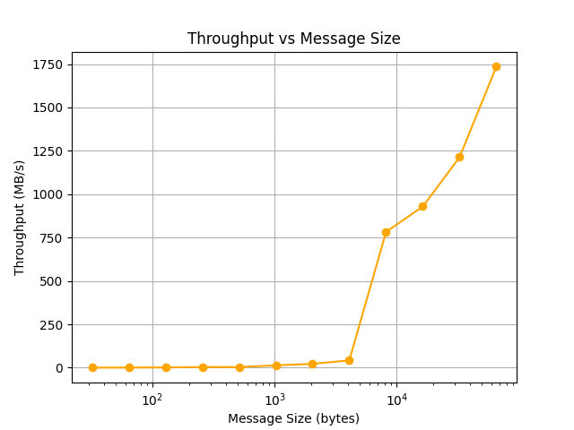

# SockBench

SockBench is a lightweight **network benchmarking tool** written in **C++** to measure **latency** and **throughput** of TCP socket communication on Linux.  
It was built to explore **transport stack performance**, similar to what large-scale systems (e.g., AI clusters, datacenter networks) rely on.

---

## Features
- TCP **client–server echo benchmark**
- Measures:
  - Average round-trip **latency** (ms)
  - Achievable **throughput** (MB/s)
- Command-line arguments:
  ```bash
  ./client <message_size> <num_messages>
  ```
* Automatic results logging to `results.csv`
* Python script to generate **plots** for visualization

---

## Usage

### 1. Compile

```bash
g++ server.cpp -o server
g++ client.cpp -o client
```

### 2. Run

Open **two terminals**:

Terminal 1 (server):

```bash
./server
```

Terminal 2 (client benchmark):

```bash
./client 1024 10000
```

### 3. Run Benchmarks

Automate multiple test runs with:

```bash
./bench.sh
```

This will run tests for multiple message sizes and save results to `results.csv`.

### 4. Plot Results

From project root:

```bash
python3 results/plot_results.py
```

Outputs:

* `results/latency.png`
* `results/throughput.png`

---

## Results

| Message Size | Avg Latency (ms) | Throughput (MB/s) |
| ------------ | ---------------- | ----------------- |
| 32 B         | 0.0618           | 0.49              |
| 64 B         | 0.179            | 0.34              |
| 512 B        | 0.159            | 3.07              |
| 1 KB         | 0.097            | 10.0              |
| 4 KB         | 0.053            | 73.8              |
| 64 KB        | 0.030            | 2049.9            |

### Latency vs Message Size



### Throughput vs Message Size



---

## Project Structure

```
SockBench/
├── server.cpp           # Echo server
├── client.cpp           # Benchmark client (CSV output)
├── bench.sh             # Automates multiple runs
├── results.csv          # Benchmark data
├── results/
│   ├── plot_results.py  # Python plotting script
│   ├── latency.png      # Latency plot
│   └── throughput.png   # Throughput plot
└── README.md
```

---

## Next Steps

* Add **UDP benchmarks** for comparison
* Add **multi-threaded client** (simulate concurrent connections)
* Use **non-blocking epoll** for scalable server design
* Extend to **distributed benchmarking** across multiple machines

---

## Why This Project?

This project was created to understand how **message size impacts transport performance**.
It shows real-world tradeoffs between:

* **Latency** (small packets are slow due to overhead)
* **Throughput** (large packets maximize bandwidth)

This mirrors challenges faced in **host networking, RDMA, and distributed systems** development.